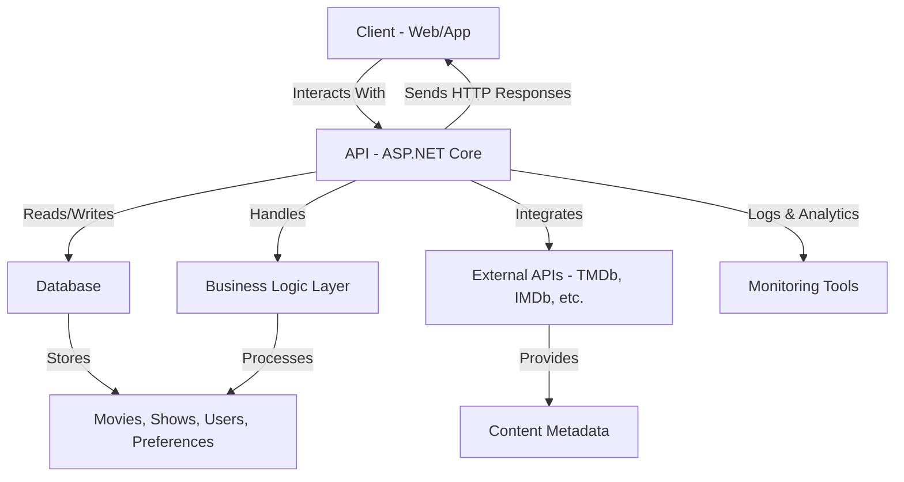

# Project Architecture

## HIGH LEVEL UNDERSTANDING

The **CaptainWatch.Api Project** is an API service designed to provide movie and TV show data, user interactions, and recommendations. It manages content aggregation, user preferences, and analytics, aiming to deliver a seamless backend for applications consuming entertainment-related data.

### Architecture Diagram



### TECHNOLOGY STACK

- **API:** ASP.NET Core (C#)
- **Database:** SQL Server (or another RDBMS)
- **ORM:** Entity Framework Core
- **External Integrations:** TMDb API, IMDb API, other content sources
- **Authentication:** JWT, OAuth2 (if applicable)
- **Monitoring:** Serilog, Application Insights
- **Testing:** xUnit, Moq

### DESIGN DECISIONS

- **Separation of Concerns:** The project separates API, data access, business logic, and integration layers for maintainability and testability.
- **RESTful API:** The API exposes REST endpoints for CRUD operations and recommendations.
- **Configurable Integrations:** External API keys and endpoints are managed via configuration files for flexibility.
- **Entity Framework Core:** Used for efficient and type-safe data access.
- **Extensible:** Designed to add new content providers or recommendation algorithms with minimal changes.

### OVERVIEW OF KEY COMPONENTS

The project consists of several main layers:

#### API Layer

- **Main Entry Point:** `CaptainWatch.Api/Program.cs` & `Startup.cs` (or `Main` and configuration files)
  - Configures services, middleware, and launches the web API.

##### Controllers

- **Purpose:** Define endpoints for clients to interact with movies, shows, user data, and recommendations.
- **Key Features:** Attribute routing, input validation, authentication.

#### Business Logic Layer

- **Purpose:** Contains core logic for recommendations, user actions, and data aggregation.
- **Key Features:** Decoupled from data access, testable services.

#### Data Access Layer

- **Purpose:** Manages database interactions via repositories and Entity Framework.
- **Key Features:** Database migrations, type-safe queries, transaction management.

#### External Integrations

- **Purpose:** Fetch data from external APIs like TMDb or IMDb.
- **Key Features:** API clients, rate limiting, caching responses.

### CODE MAP

#### Directory Structure

```plaintext
CaptainWatch.Api/
│   ├── Controllers/          # API controllers
│   ├── Models/               # Data models and DTOs
│   ├── Services/             # Business logic and external integrations
│   ├── Data/                 # EF Core DbContext and migrations
│   ├── appsettings.json      # Configuration file (API keys, DB connection)
│   ├── Program.cs            # Entry point
│   ├── Startup.cs            # Configuration (if .NET 5/3.1) or minimal API setup
│   └── Tests/                # Unit and integration tests
```

#### API Overview

##### GET /movies

- **Description**: Retrieves a list of movies, possibly with filters (genre, year, etc.).
- **Response**: Returns a JSON array of movie objects.

##### GET /shows

- **Description**: Retrieves a list of TV shows.
- **Response**: Returns a JSON array of show objects.

##### POST /users/{id}/preferences

- **Description**: Updates or sets user preferences.
- **Request Body**: JSON object with user preference data.
- **Response**: Confirmation and the updated preferences.

##### GET /recommendations

- **Description**: Returns personalized recommendations based on user history and preferences.
- **Response**: JSON array of recommended items.

### ADDITIONAL NOTES

**Error Handling:** The API returns standardized error responses (with codes and messages) for invalid input, authentication issues, and integration errors.

**Scalability:** Designed for growth—can scale horizontally with stateless API and a scalable database backend.

**Testing:**

- **API:** Unit and integration tests for controllers and services are in `Tests/`.
- **Data Layer:** Tests for repository patterns and DbContext.
